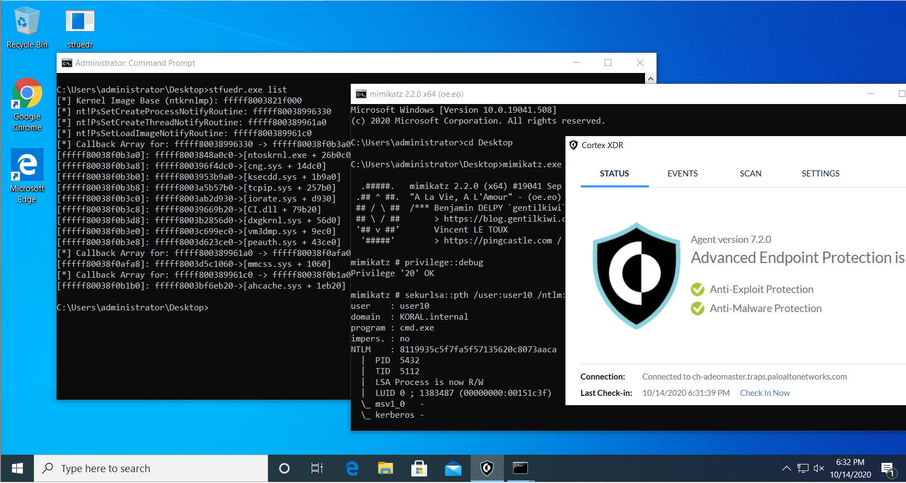

# STFUEDR
Silence EDRs by removing kernel callbacks

A lot of modern AV/EDR technologies monitor process/thread creation events by registering PspSetXXXXNotifyRoutine callback. This code checks for popular EDR/AV driver names and removes them from PspSetXXXXNotifyRoutine callback array.

Everything is already greatly explained

here: https://www.redcursor.com.au/blog/bypassing-lsa-protection-aka-protected-process-light-without-mimikatz-on-windows-10  and

here: https://www.youtube.com/watch?v=85H4RvPGIX4

The original exploit code: https://br-sn.github.io/Removing-Kernel-Callbacks-Using-Signed-Drivers/

